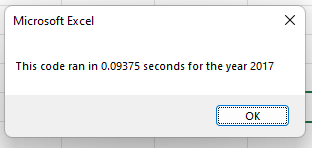
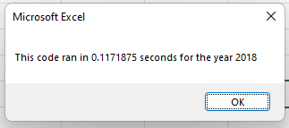
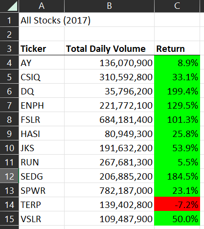
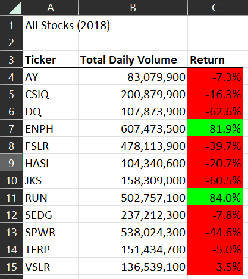

# VBA Stock Analysis

## Overview of Project
We have been tasked with refactoring our stock market analysis program into a program that is able to quickly analyze thousands of stocks quickly. To ensure that we have properly lessened the run time of our program we will add a display box with the time to execute. To refactor this code we will create loops that cycle through all of the data in a single step rather than taking a number of steps. 

### Results of Refactoring
After creating a number of nested loops and promting the user to input the specific year for analysis we have reduced the runtime of the program to less than a second for both years of analysis.

For 2017 it took only 0.09375 seconds to run a full analysis of thousands of data points.

We saw the similar positive results for our 2018 dataset, finishing in only 0.1171875 seconds.

With these outputs, I believe, we can call our refactoring a success. With runtimes around a tenth of a second we are able to analyze thousands of data points thousands of times faster than any person would be able to, and faster than our previous code we had been using.

### Summary of Analysis
After our analysis we can say with certainty that losses in 2018 were significantly higher than in 2017. Most indexes showed loss aside from RUN and ENPH. The two indexes that go against this trend are RUN and TERP. These indexes did better in 2018 than 2017, even though that improvement for TERP was simply less loss of return in 2018 than 2017, where it also showed a net loss. 

With the results of our analysis side by side it is very obvious that 2018 saw a very difficult year for return on investment.

With our analysis a stock trader could be able to quickly determine the historical trend of the stock market without exhaustive picking through many data points.
